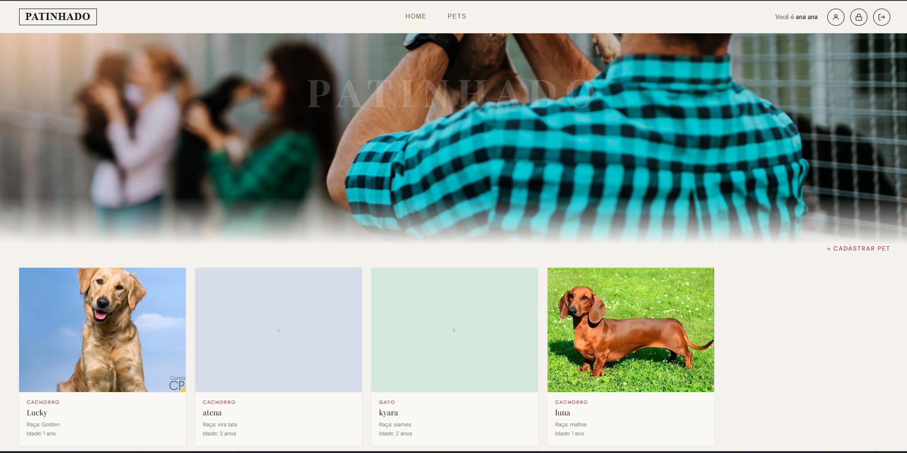
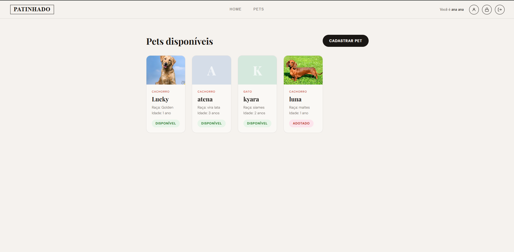
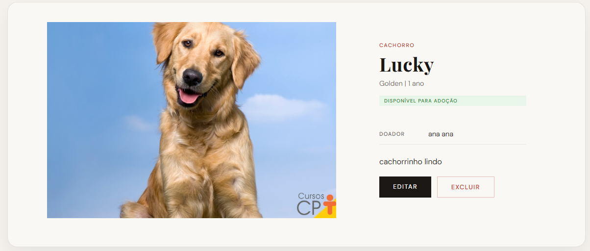

# Patinhado2-Front

Front-end do projeto Patinhado — plataforma de adoção de pets.

## Integrantes
- Ana Luiza Marques
- Arthur Augusto

## Descrição
Site para cadastro e adoção de pets. Usuários podem se cadastrar, gerenciar perfil, cadastrar pets para adoção, solicitar adoção de pets e gerenciar solicitações recebidas.

## Tecnologias
- HTML5, CSS3
- TypeScript (compilado para JavaScript)
- SPA com hash-based routing
- Consome API REST do backend Django

## Instalação local

### Pré-requisitos
- Node.js (para compilar TypeScript)
- Backend Django rodando em `http://localhost:8000`

### Passos

1. Clone o repositório:
   ```bash
   git clone <url-do-repositorio>
   cd Patinhado2-Front
   ```

2. Instale dependências (TypeScript):
   ```bash
   npm install
   ```

3. Compile o TypeScript:
   ```bash
   npx tsc
   ```

4. Sirva o front-end com um servidor estático:
   ```bash
   npx serve public
   ```

5. Acesse `http://localhost:3000`

## Funcionalidades
- **Autenticação**: Login, cadastro, logout
- **Perfil**: Visualizar, editar dados, excluir conta
- **Senha**: Alterar senha, recuperar senha (via email)
- **Pets**: Listar, cadastrar, editar, excluir, ver detalhes
- **Adoção**: Solicitar adoção, gerenciar solicitações (aprovar/rejeitar/cancelar)
- **Visões por usuário**: Doador vê ações de edição/exclusão; adotante vê botão de adoção

## Estrutura do projeto
```
public/
  index.html          # Entry point da SPA
  css/                # Estilos CSS
  javascript/         # JavaScript compilado do TypeScript
  img/                # Imagens
typescript/           # Código-fonte TypeScript
  app.ts              # Entry point e configuração de rotas
  api.ts              # Cliente HTTP com JWT
  auth.ts             # Autenticação
  pets.ts             # CRUD de pets
  pedidos.ts          # Solicitações de adoção
  profile.ts          # Perfil do usuário
  password.ts         # Gerenciamento de senha
  router.ts           # Roteamento SPA
  layout.ts           # Header/footer reutilizável
  pages/              # Páginas da aplicação
    home.ts, login.ts, register.ts, logout.ts,
    profile.ts, editProfile.ts, deleteProfile.ts,
    petList.ts, petDetail.ts, addPet.ts, petEdit.ts, petDelete.ts,
    adoptPet.ts, pedidoDetail.ts, pedidoEdit.ts,
    passwordChange.ts, passwordReset.ts, passwordResetConfirm.ts,
    about.ts, contact.ts
```

## API
Configurar a URL da API no arquivo `typescript/api.ts`:
```typescript
const API_BASE = 'http://localhost:8000/api';
```

## Screenshots






## O que funcionou
- CRUD usuário
- CRUD pedidos de adoção
- CRUD pets

## Disclaimer

Este trabalho foi desenvolvido com auxílio de inteligência artificial.

- **Modelo de IA**: Big Pickle (opencode/big-pickle)
- **Ferramenta**: OpenCode
